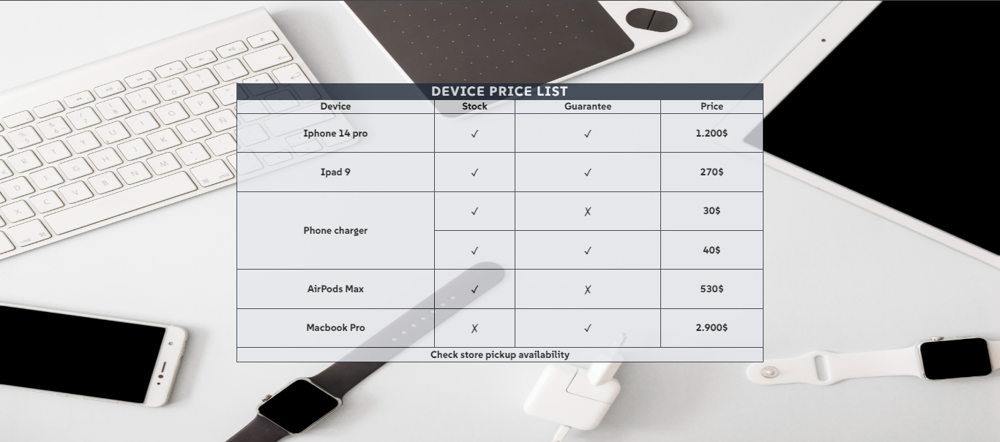

# Project - Device price list
Simple list creation challenge.

## Table of contents

- [Overview](#overview)
  - [Screenshot](#screenshot)
  - [Links](#links)
- [My process](#my-process)
  - [Built with](#built-with)
- [Author](#author)
- [Acknowledgments](#acknowledgments)

## Overview

This project shows a simple price table for devices for sale on the website.

### Screenshot

### Links

- [Solution](https://github.com/AllanSancley/Device-price-list.git)
- [Live Site](https://device-price-list.netlify.app/)

## My process

In this challenge I made a simple table to improve my knowledge and exercise some points that were weak in my development.

### Built with

- Semantic HTML5 markup
- CSS custom properties
-Flexbox

## Author

- Frontend Mentor - [@AllanSancley](https://www.frontendmentor.io/profile/AllanSancley)
- Github - [@AllanSancley](https://github.com/AllanSancley)
- Linkedin - [Allan Sancley](www.linkedin.com/in/allan-sancley-12b583193)
